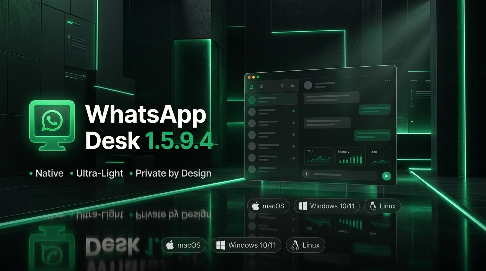
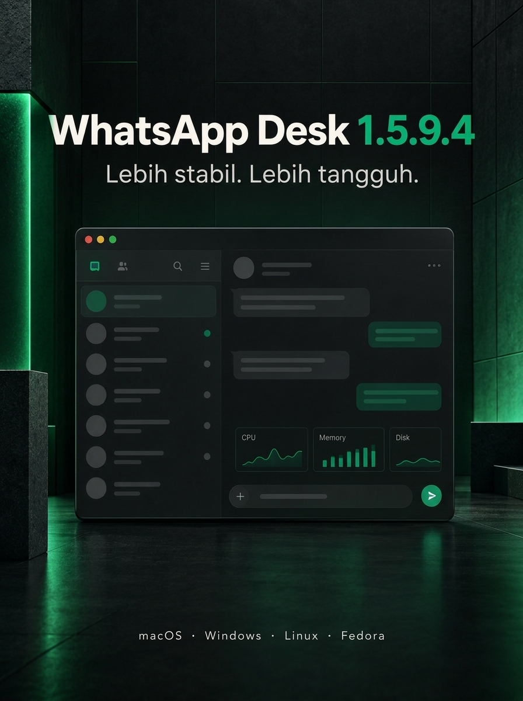

<p align="center">
  
</p>

<p align="center">
  <a href="https://github.com/vianziro/Whatsapp-Dekstop/releases/latest"></a>
  <a href="https://github.com/vianziro/Whatsapp-Dekstop/releases"></a>
  <a href="LICENSE"></a>
  <a href="https://go.dev/"></a>
  <a href="https://github.com/vianziro/Whatsapp-Dekstop/releases/latest"></a>
</p>

<p align="center">
  <strong>WhatsApp Desk</strong> is a fast, ultra-lightweight, privacy-respecting desktop client for <a href="https://web.whatsapp.com">WhatsApp Web</a>.<br>
  Built with native operating system web engines — <strong>WebKit</strong> on macOS, <strong>WebView2</strong> on Windows, and <strong>WebKitGTK</strong> on Linux.<br>
  <em>Zero Electron bloat • Zero telemetry • Zero message relay servers • Complete local privacy.</em>
</p>

---

<p align="center">
  
</p>

---

## ⚡ Download (v1.5.9.4)

| Platform | Recommended Installer | Portable / Alternative | Requirements |
| :--- | :--- | :--- | :--- |
| **macOS** | [**Universal DMG**](https://github.com/vianziro/Whatsapp-Dekstop/releases/latest/download/WhatsApp-Desk-macOS-Universal.dmg) | [Universal ZIP](https://github.com/vianziro/Whatsapp-Dekstop/releases/latest/download/WhatsApp-Desk-macOS-Universal.zip) | macOS 11.0+ (Apple Silicon & Intel) |
| **Windows 10 / 11** | [**Setup Wizard (.exe)**](https://github.com/vianziro/Whatsapp-Dekstop/releases/latest/download/WhatsApp-Desk-Windows-x64-Setup.exe) | [Portable EXE](https://github.com/vianziro/Whatsapp-Dekstop/releases/latest/download/WhatsAppDesk.exe) | Windows 10/11 x64 (WebView2 runtime) |
| **Debian / Ubuntu** | [**DEB Package**](https://github.com/vianziro/Whatsapp-Dekstop/releases/download/v1.5.9.2/WhatsApp-Desk-Linux-amd64.deb) | [tar.gz Archive](https://github.com/vianziro/Whatsapp-Dekstop/releases/download/v1.5.9.2/WhatsApp-Desk-Linux-x64.tar.gz) | GTK 3 & WebKitGTK 4.0/4.1 *(v1.5.9.2)* |
| **Fedora / RHEL** | [**RPM Package**](https://github.com/vianziro/Whatsapp-Dekstop/releases/download/v1.5.9.2/WhatsApp-Desk-Fedora-x64.rpm) | [tar.gz Archive](https://github.com/vianziro/Whatsapp-Dekstop/releases/download/v1.5.9.2/WhatsApp-Desk-Linux-x64.tar.gz) | WebKitGTK 4.1 *(v1.5.9.2)* |

> [!NOTE]
> Linux packages remain pinned to **v1.5.9.2** while the Linux build of the current release is being verified. You can [browse all releases](https://github.com/vianziro/Whatsapp-Dekstop/releases) anytime.

---

## ✨ Key Features

* 🚀 **Ultra-Lightweight Engine:** Built directly on native OS webviews (WebKit on macOS, WebView2 on Windows, WebKitGTK on Linux). Minimal RAM and battery footprint compared to Chromium/Electron apps.
* 🛡️ **Zero Telemetry & Private by Design:** Communicates straight with `https://web.whatsapp.com`. No analytics tracking, no user profiling, and no proxy or relay servers.
* 👁️ **Instant Privacy Mode & Auto-Lock:** Quickly redact chat previews, sender names, and media thumbnails with a shortcut (`Ctrl+Shift+P` / `Cmd+Shift+P`) or automatic lock on idle.
* 📄 **Built-in Document & Office Preview:** Instant in-app previews for PDFs, Word docs, Excel spreadsheets, PowerPoint slides, and text attachments without cluttering your drive with duplicate files.
* 🛠️ **Windows Setup Wizard:** Per-user installer with branded artwork, Start Menu and desktop shortcuts, and clean uninstallation in Windows Apps & Features.
* ⚙️ **Unified Settings & Module Guard:** Single accessible settings control (`Ctrl+,` / `Cmd+,`) protected by runtime module isolation (`waRunModule`) against unexpected DOM changes.
* 🔄 **Built-in Self Updater:** Automatic update notifications with cryptographic `SHA256SUMS` validation before applying updates.
* 🖥️ **Per-Monitor Window Memory:** Automatically remembers window position and dimension across multi-monitor setups.

---

## 📸 Application Preview

<p align="center">
  
</p>

<p align="center">
  
</p>

*Note: Screenshots use blurred chat content to protect personal information.*

---

## ⌨️ Keyboard Shortcuts

| Feature | macOS | Windows & Linux |
| :--- | :--- | :--- |
| **Open Settings** | <kbd>Cmd</kbd> + <kbd>,</kbd> | <kbd>Ctrl</kbd> + <kbd>,</kbd> |
| **Toggle Privacy Mode** | <kbd>Cmd</kbd> + <kbd>Shift</kbd> + <kbd>P</kbd> | <kbd>Ctrl</kbd> + <kbd>Shift</kbd> + <kbd>P</kbd> |
| **Toggle Always on Top** | <kbd>Cmd</kbd> + <kbd>Shift</kbd> + <kbd>T</kbd> | <kbd>Ctrl</kbd> + <kbd>Shift</kbd> + <kbd>T</kbd> |
| **Mute / Unmute Audio** | <kbd>Cmd</kbd> + <kbd>Shift</kbd> + <kbd>M</kbd> | <kbd>Ctrl</kbd> + <kbd>Shift</kbd> + <kbd>M</kbd> |
| **Open Downloads Folder** | <kbd>Cmd</kbd> + <kbd>Shift</kbd> + <kbd>D</kbd> | <kbd>Ctrl</kbd> + <kbd>Shift</kbd> + <kbd>D</kbd> |
| **Check for Updates** | <kbd>Cmd</kbd> + <kbd>Shift</kbd> + <kbd>U</kbd> | <kbd>Ctrl</kbd> + <kbd>Shift</kbd> + <kbd>U</kbd> |
| **Hard Refresh Web View** | <kbd>Cmd</kbd> + <kbd>Shift</kbd> + <kbd>R</kbd> | <kbd>Ctrl</kbd> + <kbd>Shift</kbd> + <kbd>R</kbd> |
| **Zoom In / Out / Reset** | <kbd>Cmd</kbd> + <kbd>+</kbd> / <kbd>-</kbd> / <kbd>0</kbd> | <kbd>Ctrl</kbd> + <kbd>+</kbd> / <kbd>-</kbd> / <kbd>0</kbd> |

---

## 📦 Installation & Setup

### macOS (Universal)
1. Download [**WhatsApp-Desk-macOS-Universal.dmg**](https://github.com/vianziro/Whatsapp-Dekstop/releases/latest/download/WhatsApp-Desk-macOS-Universal.dmg).
2. Open the DMG and drag **WhatsApp Desk** into **Applications**.
3. *First launch:* If macOS Gatekeeper alerts you, right-click the application and select **Open**.

### Windows 10 / 11 (x64)
1. Download and run [**WhatsApp-Desk-Windows-x64-Setup.exe**](https://github.com/vianziro/Whatsapp-Dekstop/releases/latest/download/WhatsApp-Desk-Windows-x64-Setup.exe).
2. The setup wizard installs WhatsApp Desk per-user (no Administrator rights required) and adds Start Menu and desktop shortcuts.
3. *SmartScreen Note:* Since community binaries are unsigned (no EV certificate), choose **More info** → **Run anyway**.

### Linux (Debian / Ubuntu / Fedora)
```bash
# Debian / Ubuntu (x64)
sudo dpkg -i WhatsApp-Desk-Linux-amd64.deb
sudo apt-get install -f

# Fedora / RHEL (x64)
sudo dnf install ./WhatsApp-Desk-Fedora-x64.rpm
```

### Verifying Release Integrity

Every release ships with a signed [SHA256SUMS](https://github.com/vianziro/Whatsapp-Dekstop/releases/latest/download/SHA256SUMS) checksum list:

```bash
# macOS
shasum -a 256 -c SHA256SUMS

# Linux
sha256sum -c SHA256SUMS

# Windows PowerShell
(Get-FileHash .\WhatsApp-Desk-Windows-x64-Setup.exe -Algorithm SHA256).Hash.ToLower()
```

---

## Privacy

WhatsApp Desk loads `https://web.whatsapp.com` directly. Session and cache data remain inside the application's local profile. The application does not add an analytics service or a message relay server.

Errors and crash logs stay on your machine. Nothing is ever uploaded automatically: the Control Center's Report button (or the post-crash nudge) only opens a pre-filled GitHub issue in your browser, which you review before submitting.

Default profile locations:

- macOS: `~/Library/Application Support/WhatsAppDesk/UserData/`
- Windows: `%APPDATA%\WhatsAppDesk\UserData\`
- Linux: `~/.config/whatsapp-desk/`

## Version 1.5.9.4

- Fixes MutationObserver initialization crash on Windows WebView2 (#12): guards documentElement and head during pre-DOM script creation so the Settings modal opens reliably instead of triggering recovery mode.
- Isolates runtime injected modules (`waRunModule`): individual DOM observation or feature errors can no longer abort other modules or prevent Settings and shortcuts from loading.
- Windows installer setup wizard and portable binary updated.

## Version 1.5.9.3

- Settings now appears exactly once: the rail fallback and the last-resort launcher stay hidden while the header control is visible, so no duplicate gear can appear.
- Windows installer is now a full setup wizard with branded graphics, Start Menu and desktop shortcuts, and a proper Apps & features entry with uninstall. The portable EXE remains available.
- Restores the last-resort Settings launcher when the other entry points fail, so the panel stays reachable.
- Fixes per-monitor window placement: each display remembers its own position and size, and a frame from a disconnected monitor is never restored off-screen.

## Version 1.5.9.2

- Reduced CPU spikes while scrolling by deferring non-essential DOM observers and capping media/spellcheck scan batches.
- Added local Help & diagnostics with a shortcut reference; it never sends chat data or files.
- Added Fedora/RHEL x64 RPM packaging alongside the portable Linux archive.

## Version 1.5.9.1

- Linux update selection now distinguishes x64 and arm64, preventing an incompatible x64 download on arm64 devices.
- Release automation builds and publishes macOS, Windows x64, Linux x64, and Linux arm64 from the tagged source version.
- Removed the repository-tracked pseudo-secret build gate; it did not provide runtime security and could make a clean build fail unexpectedly.

## Version 1.5.9

- Critical fix: removed the v1.5.8 CSP policy that blocked WhatsApp boot bundles and left the app stuck on the splash screen.
- If you installed v1.5.8, update to v1.5.9 (in-app updater or fresh download).

## Version 1.5.8

- Native folder picker on Linux (GTK) and system tray with quick controls.
- Unified settings storage and extended WebView2 cache cleanup on Windows.
- Drag & drop files into chat, native spellcheck, and search/translate context menu.
- Taskbar progress badge on Windows and tray unread indicator on Linux.
- Hardened runtime on macOS, lazy spreadsheet engine, and CSP hardening.
- Unified `build.sh` and CI builds for macOS, Windows, and Linux.

## Version 1.5.7

- Attach menu works on macOS: Document and Photos & videos now open the native file picker.
- Files are no longer saved twice when a download is triggered from two paths.
- All v1.5.6 fixes included: silent background update on Windows (no console flashes), Fedora RPM packages, reliable document preview and appearance switching.

Older releases are retained for reference but are deprecated.

## License and disclaimer

Licensed under the [MIT License](LICENSE).

This is an independent project and is not affiliated with, authorized by, or endorsed by WhatsApp or Meta Platforms, Inc. WhatsApp is a trademark of its respective owner.
